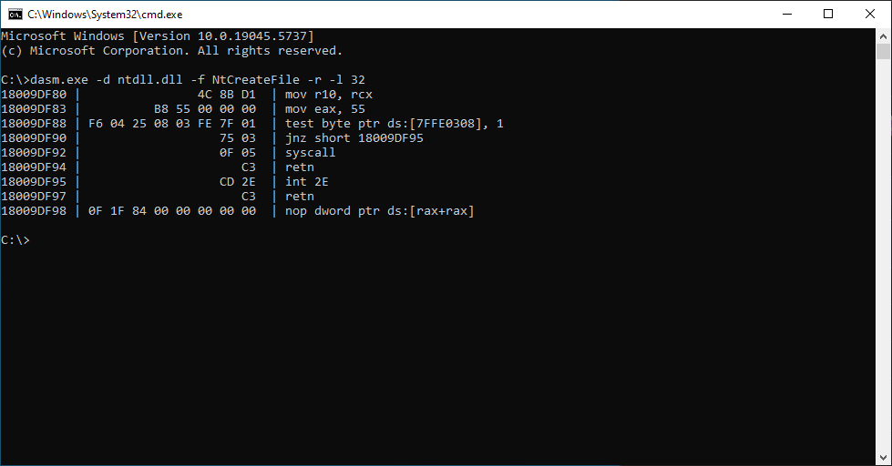

# dasm
Reload dll module and disassemble function address


# usage
```
Usage: dasm.exe [OPTIONS]

Options:
  -d <dll>       DLL name
  -f <func>      Function name (requires -d)
  -i <address>   Memory address (alternative to -d/-f)
  -r             Enable reload module mode (optional)
  -l <length>    Specify length (optional, default: 32)

Examples:
  dasm.exe -d kernel32.dll -f CreateProcess -r -l 100
  dasm.exe -i 0x12345678 -l 50
```
